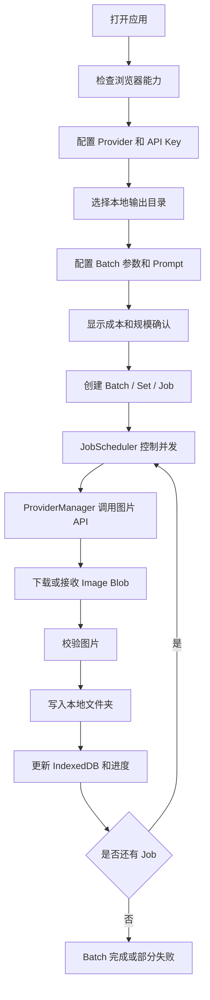

# AI Batch Image Generator 产品需求文档

## 1. 产品概述

AI Batch Image Generator 是一个纯前端 Web 应用，用于批量调用第三方 AI 图片生成 API，并将生成结果直接保存到用户选择的本地文件夹。

- 目标用户是个人创作者、挂历图片生产者和内部批量素材生成团队。
- 核心价值是在不维护后端服务器的前提下，完成 1000 Sets / 13000 Images 级别的批量图片生成、断点恢复和本地落盘。

## 2. 核心功能

### 2.1 用户角色

当前 MVP 不区分用户角色。

| 角色 | 注册方式 | 核心权限 |
|------|----------|----------|
| 本地用户 | 无需注册 | 配置 Provider、创建 Batch、选择本地目录、执行批量生成、恢复任务、导入导出配置 |

### 2.2 功能模块

1. **Dashboard 页面**：展示当前任务、总进度、失败数、成本估算和运行状态。
2. **Generator 页面**：配置 Provider、模型、API Key、Prompt、输出目录、Set 数量、并发和图片尺寸，并启动任务。
3. **Batches 页面**：查看历史 Batch，进入详情，恢复或删除本地任务记录。
4. **Batch Detail 页面**：查看 Set 与 Job 级别状态，执行 Pause、Resume、Cancel、Retry Failed。
5. **Gallery 页面**：按 Batch / Set / Status 查看已生成图片，采用懒加载和虚拟化策略。
6. **Settings 页面**：管理 Provider、默认参数、Prompt 模板、配置导入导出。

### 2.3 页面详情

| 页面名称 | 模块名称 | 功能描述 |
|----------|----------|----------|
| Dashboard | 任务总览 | 展示当前 Batch、Sets、Images、Completed、Failed、Processing、Remaining、Progress、Estimated Cost、Actual Cost |
| Dashboard | 快速操作 | 提供继续任务、查看失败、进入详情、创建新任务入口 |
| Generator | Provider 配置 | 选择 Provider、Model，输入 API Key，显示 CORS 兼容性提示 |
| Generator | 输出目录 | 调用 File System Access API 选择本地输出目录，展示权限状态 |
| Generator | 批量参数 | 设置 Set Count、Images Per Set、Width、Height、Concurrency、Seed Mode |
| Generator | Prompt 模板 | 编辑 Prompt Template、Negative Prompt，支持变量预览 |
| Generator | 启动确认 | 大批量任务启动前展示成本、图片数量、并发和输出目录二次确认 |
| Batches | Batch 列表 | 展示历史任务状态、创建时间、进度、失败数量、成本 |
| Batch Detail | Set 列表 | 按 Set 展示 13 张图片的完成情况，支持虚拟列表 |
| Batch Detail | Job 明细 | 点击 Set 后展示 01 到 13 的 Job 状态、错误原因和单独重试 |
| Batch Detail | 控制栏 | 支持 Pause、Resume、Cancel、Retry Failed |
| Gallery | 图片预览 | 展示已生成图片，支持筛选和懒加载，不自动加载全部原图 |
| Settings | Provider 管理 | 启用/禁用 Provider，配置默认模型、单价、API Key |
| Settings | Prompt 模板 | 保存和选择常用 Prompt 模板 |
| Settings | 导入导出 | 导入/导出非敏感配置，不导出 API Key |

## 3. 核心流程

用户主要流程：

1. 用户打开应用，系统检查浏览器是否支持 `showDirectoryPicker`。
2. 用户在 Settings 或 Generator 中配置 Provider 和 API Key。
3. 用户选择输出目录，浏览器授予本地文件写入权限。
4. 用户配置 Set 数量、每 Set 图片数、Prompt、尺寸、并发、Seed 和重试策略。
5. 系统展示预计图片数量和预计成本，大批量任务需要二次确认。
6. 用户启动 Batch，系统创建 Sets 和 Jobs，并写入 IndexedDB。
7. BatchEngine 启动 JobScheduler，按并发限制消费 Job。
8. 每个 Job 调用 ProviderManager，再调用具体 Provider 获取图片。
9. 图片转换为 Blob，完成基础校验后通过 FileSystemService 写入本地目录。
10. 每个 Job 状态变化写入 IndexedDB，进度聚合节流更新。
11. 用户可以 Pause、Resume、Cancel、Retry Failed。
12. 浏览器刷新后，系统从 IndexedDB 和本地文件恢复任务状态。

## 4. 用户界面设计

### 4.1 设计风格

- 设计方向：工业级控制台 + 精致创作者工具，强调稳定、可监控、可信任。
- 主色：深墨蓝 `#101923`，用于整体背景和控制台氛围。
- 强调色：电气青 `#32d5ff`，用于运行状态、进度和主要操作。
- 辅助色：琥珀黄 `#f6b443`，用于成本、警告和等待状态。
- 成功色：叶绿 `#41d681`；失败色：珊瑚红 `#ff5f6d`。
- 字体：标题使用具有工程感的窄体或几何字体，正文使用清晰可读的无衬线字体。
- 布局：桌面优先，左侧导航 + 顶部状态栏 + 主内容卡片网格。
- 动效：启动任务、进度变化、状态切换使用克制的微动效，避免干扰长时间任务监控。

### 4.2 页面设计概览

| 页面名称 | 模块名称 | UI 元素 |
|----------|----------|---------|
| Dashboard | 任务总览 | 大号进度环、关键指标卡片、运行状态灯、成本卡片、任务时间线 |
| Generator | 参数配置 | 分组表单、Provider 状态徽章、输出目录权限条、Prompt 编辑器、成本预览侧栏 |
| Batches | 历史任务 | 可筛选表格、状态标签、进度条、批量操作按钮 |
| Batch Detail | Set 监控 | 虚拟列表、Set 状态矩阵、Job 明细抽屉、错误详情面板 |
| Gallery | 图片浏览 | Masonry 或网格视图、状态筛选、懒加载缩略图、Set 分组 |
| Settings | 设置中心 | Provider 卡片、API Key 掩码输入、价格配置、模板管理、导入导出 |

### 4.3 响应式

- MVP 采用桌面优先设计，主要支持 Chrome / Edge 桌面浏览器。
- 平板尺寸保持可用，但大批量任务监控以桌面体验为主。
- 移动端只保证基础浏览，不作为核心生成任务入口。
- 列表、表格和图片网格必须支持滚动容器和虚拟渲染。

## 5. MVP 验收标准

- 浏览器直接调用第三方 AI 图片 API，不引入后端。
- API Key 只保存在本地 IndexedDB，不导出、不打印、不上传。
- 用户可以选择本地输出目录，并自动创建 `set_000001` 等子目录。
- 每个 Set 默认生成 13 张图片，文件名为 `01.jpg` 到 `13.jpg`。
- 支持并发控制，默认并发为 10，范围为 1 到 100。
- 支持 Retry、429 Retry-After、Pause、Resume、Cancel、Retry Failed。
- 支持 IndexedDB 持久化和浏览器刷新后的状态恢复。
- 已存在且大小大于 0 的图片不会重复生成。
- 支持 1000 Sets / 13000 Images 的任务规模，不因全量渲染导致 UI 卡死。
- 至少实现 `MockProvider` 和一个真实 Provider 接入点。

## 6. 非目标范围

MVP 不做：

- 后端服务
- Backend Proxy
- 用户登录
- 云端同步
- 服务端数据库
- 服务端任务队列
- 浏览器关闭后继续生成
- Electron / Tauri
- Vision Model 自动质检
- 公开 SaaS 多租户能力
