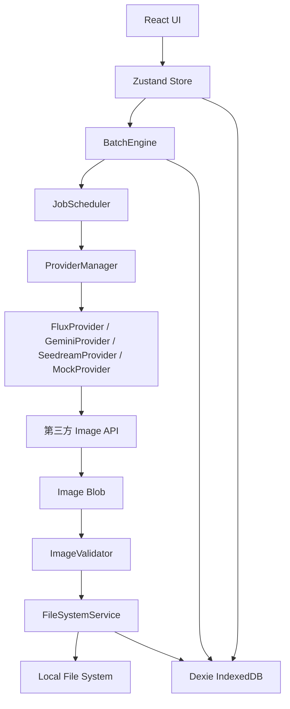
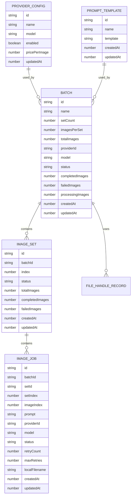

# 小明专用 技术架构文档

## 1. 架构设计

本项目采用纯前端架构：React 应用运行在浏览器内，直接调用第三方 Image Generation API，通过 IndexedDB 保存任务状态，通过 File System Access API 将图片写入用户选择的本地目录。



核心原则：

- 无后端、无服务端数据库、无任务服务器。
- 业务层只调用 `ProviderManager`，不直接 `fetch` 第三方 API。
- UI 和 BatchEngine 不直接操作 File System Access API，统一通过 `FileSystemService`。
- 大量 Job 不全量渲染，使用 IndexedDB 分页查询和虚拟列表。
- API Key 不离开浏览器本地环境。

## 2. 技术说明

- 前端框架：`React` + `TypeScript` + `Vite`
- UI 组件：`Ant Design`
- 状态管理：`Zustand`
- 本地持久化：`Dexie.js` + `IndexedDB`
- 本地文件系统：`File System Access API`
- HTTP：优先使用原生 `fetch`
- 虚拟列表：优先使用 Ant Design 虚拟能力，必要时引入 `react-window`
- 初始化工具：`Vite`

推荐依赖：

```text
react
react-dom
typescript
vite
antd
@ant-design/icons
zustand
dexie
```

## 3. 路由定义

| 路由 | 用途 |
|------|------|
| `/` | 重定向到 Dashboard |
| `/dashboard` | 当前任务总览、进度和成本 |
| `/generator` | 创建 Batch、配置 Provider、Prompt 和输出目录 |
| `/batches` | 历史 Batch 列表 |
| `/batches/:batchId` | Batch Detail，查看 Set / Job 状态 |
| `/gallery` | 查看已生成图片 |
| `/settings` | Provider、Prompt、默认参数、导入导出 |

## 4. 前端模块划分

```text
src/
├── app/
│   ├── App.tsx
│   ├── router.tsx
│   └── providers.tsx
├── components/
│   ├── common/
│   ├── batch/
│   ├── provider/
│   ├── prompt/
│   └── settings/
├── pages/
│   ├── Dashboard/
│   ├── Generator/
│   ├── Batches/
│   ├── BatchDetail/
│   ├── Gallery/
│   └── Settings/
├── stores/
│   ├── batchStore.ts
│   ├── jobStore.ts
│   ├── providerStore.ts
│   └── settingsStore.ts
├── services/
│   ├── providers/
│   ├── batch/
│   ├── filesystem/
│   ├── storage/
│   └── cost/
├── types/
└── utils/
```

## 5. API 定义

本项目没有自己的后端 API。

第三方 Provider 必须实现统一接口：

```typescript
export interface ImageProvider {
    id: string;
    name: string;
    generate(
        request: ImageGenerationRequest,
        config: ProviderRuntimeConfig
    ): Promise<ImageGenerationResult>;
}

export interface ImageGenerationRequest {
    prompt: string;
    negativePrompt?: string;
    width: number;
    height: number;
    seed?: number;
    model: string;
}

export interface ImageGenerationResult {
    success: boolean;
    imageUrl?: string;
    imageBlob?: Blob;
    providerJobId?: string;
    cost?: number;
    error?: ProviderError;
}
```

统一错误：

```typescript
export interface ProviderError {
    code?: string;
    message: string;
    httpStatus?: number;
    retryable: boolean;
    retryAfterMs?: number;
}
```

## 6. 数据模型

### 6.1 数据模型定义



### 6.2 TypeScript 数据定义

```typescript
export enum JobStatus {
    PENDING = "pending",
    PROCESSING = "processing",
    DOWNLOADING = "downloading",
    SAVING = "saving",
    SUCCESS = "success",
    FAILED = "failed",
    CANCELLED = "cancelled"
}

export enum BatchStatus {
    CREATED = "created",
    RUNNING = "running",
    PAUSED = "paused",
    COMPLETED = "completed",
    PARTIAL_FAILED = "partial_failed",
    FAILED = "failed",
    CANCELLED = "cancelled"
}

export interface Batch {
    id: string;
    name: string;
    setCount: number;
    imagesPerSet: number;
    totalImages: number;
    providerId: string;
    model: string;
    width: number;
    height: number;
    concurrency: number;
    status: BatchStatus;
    completedImages: number;
    failedImages: number;
    processingImages: number;
    estimatedCost?: number;
    actualCost?: number;
    createdAt: number;
    updatedAt: number;
}

export interface ImageSet {
    id: string;
    batchId: string;
    index: number;
    name: string;
    status: SetStatus;
    totalImages: number;
    completedImages: number;
    failedImages: number;
    createdAt: number;
    updatedAt: number;
}

export interface ImageJob {
    id: string;
    batchId: string;
    setId: string;
    setIndex: number;
    imageIndex: number;
    prompt: string;
    negativePrompt?: string;
    providerId: string;
    model: string;
    width: number;
    height: number;
    seed?: number;
    status: JobStatus;
    retryCount: number;
    maxRetries: number;
    imageUrl?: string;
    localFilename?: string;
    error?: JobError;
    estimatedCost?: number;
    actualCost?: number;
    createdAt: number;
    updatedAt: number;
    startedAt?: number;
    completedAt?: number;
}
```

## 7. IndexedDB 定义

Dexie 数据库：

```typescript
export class AIBatchDB extends Dexie {
    batches!: Table<Batch, string>;
    sets!: Table<ImageSet, string>;
    jobs!: Table<ImageJob, string>;
    providers!: Table<ProviderConfig, string>;
    prompts!: Table<PromptTemplate, string>;
    settings!: Table<AppSettingRecord, string>;
    fileHandles!: Table<FileHandleRecord, string>;

    constructor() {
        super("AIBatchDB");

        this.version(1).stores({
            batches: "id, status, createdAt, updatedAt",
            sets: "id, batchId, status, index",
            jobs: "id, batchId, setId, status, setIndex, imageIndex",
            providers: "id, enabled",
            prompts: "id, name, updatedAt",
            settings: "key",
            fileHandles: "id, batchId"
        });
    }
}
```

## 8. 调度架构

JobScheduler 必须采用固定 Worker Pool：

```text
Job Queue
  ↓
Worker Slot 1
Worker Slot 2
...
Worker Slot N
  ↓
ProviderManager
  ↓
FileSystemService
  ↓
IndexedDB
```

禁止：

```typescript
await Promise.all(jobs.map(job => generate(job)));
```

原因：

- 会一次性创建大量 Promise。
- 无法精准控制并发。
- 对 13000 Jobs 场景存在性能和稳定性风险。

## 9. 状态恢复策略

启动恢复流程：

```text
加载 RUNNING / PAUSED / PARTIAL_FAILED Batch
  ↓
恢复目录 Handle 并请求 readwrite 权限
  ↓
遍历 Job
  ↓
检查 set_000001/01.jpg 是否存在且 size > 0
  ↓
存在则标记 SUCCESS
  ↓
PROCESSING / DOWNLOADING / SAVING 重置为 PENDING
  ↓
重新聚合 Batch / Set 进度
```

## 10. 文件系统设计

输出结构：

```text
output/
├── set_000001/
│   ├── 01.jpg
│   ├── 02.jpg
│   └── 13.jpg
├── set_000002/
└── set_001000/
```

FileSystemService：

```typescript
export interface FileSystemService {
    selectDirectory(): Promise<FileSystemDirectoryHandle>;
    ensurePermission(handle: FileSystemDirectoryHandle): Promise<boolean>;
    createDirectory(
        parent: FileSystemDirectoryHandle,
        name: string
    ): Promise<FileSystemDirectoryHandle>;
    saveFile(
        directory: FileSystemDirectoryHandle,
        filename: string,
        blob: Blob
    ): Promise<void>;
    fileExists(
        directory: FileSystemDirectoryHandle,
        filename: string
    ): Promise<boolean>;
}
```

## 11. Provider 兼容性要求

任何真实 Provider 接入前必须验证：

- 是否允许浏览器 CORS 直连。
- 是否允许 `Authorization` Header。
- 是否支持 `OPTIONS` preflight。
- 是否返回 Blob、URL 或 Base64。
- 如果返回 URL，该 URL 是否允许浏览器下载。
- 是否返回稳定错误结构。
- 是否返回 `Retry-After`。
- 是否支持目标模型、尺寸、Seed 和 Negative Prompt。

不兼容 Provider 只能标记为 `Browser incompatible`，MVP 不增加后端代理。

## 12. 测试计划

Unit Test：

- `filename`
- `prompt render`
- `seed generate`
- `retry decision`
- `cost calculator`
- `status transition`

Integration Test：

- 创建 Batch / Set / Job
- Scheduler 并发控制
- Retry Failed
- Pause / Resume
- Cancel Pending Jobs
- IndexedDB 持久化

Manual Test：

- Chrome 选择本地目录
- 刷新后恢复目录权限
- MockProvider 生成 1 Set / 13 Images
- MockProvider 生成 10 Sets / 130 Images
- MockProvider 生成 100 Sets / 1300 Images
- 验证 429 Retry-After
- 验证断网重试
- 验证已存在文件跳过

## 13. 开发阶段

1. 初始化 React + Vite + TypeScript + Ant Design。
2. 搭建路由、布局和基础视觉系统。
3. 定义核心 TypeScript types。
4. 接入 Zustand 和 Dexie。
5. 实现 Settings、Provider 配置和 Prompt 模板。
6. 实现 FileSystemService。
7. 实现 Batch / Set / Job 创建。
8. 实现 MockProvider。
9. 实现 JobScheduler、RetryManager、BatchEngine。
10. 实现 Dashboard、Generator、Batches、BatchDetail、Gallery。
11. 接入一个真实 Provider。
12. 逐级测试 1 Set、10 Sets、100 Sets、1000 Sets。
